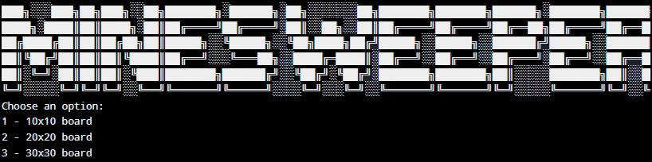
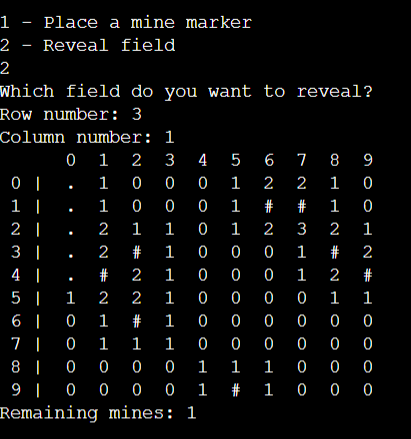
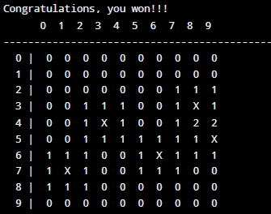
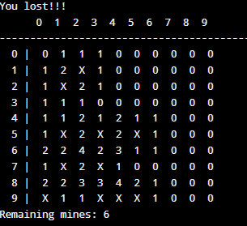

# Minesweeper in C

This project was developed during my **Algorithms and Data Structures I** course in college. The goal was to apply the core programming concepts learned throughout the semester in a fun and practical way, by building the classic **Minesweeper** game.

## 🎯 Learning Goals

Throughout development, I practiced and consolidated several key programming concepts, including:

- Conditional statements (`if`, `switch`)
- Loops (`for`, `while`)
- 2D arrays (matrices)
- Use of **pointers**
- Dynamic memory allocation (`malloc`, `free`)
- Creating and calling **functions**
- Implementing a **recursive function** to reveal empty fields

## 🕹️ How the Game Works

When running the game, the player can choose the board size (10x10, 20x20, or 30x30). Mines are randomly placed across the board.

The player can:
- Reveal a cell
- Mark a suspected mine
- Win by marking all mines correctly
- Lose by revealing a mine 💣

### 📸 Screenshots

#### Game Start


#### During Gameplay


#### You Win!


#### You Lose!


## 💻 How to Run

Compile using `gcc`:

```bash
gcc -o minesweeper main.c
./minesweeper
